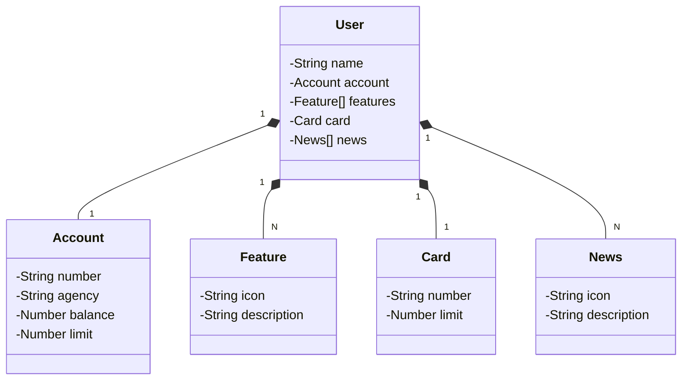

# Bootcamp Java Santander Dio

- Java RESTful API criada para Bootcamp Java Santander Dio 2024.
- Link para criação do projeto no [Spring Initializr](https://start.spring.io/#!type=gradle-project&language=java&platformVersion=3.3.1&packaging=jar&jvmVersion=17&groupId=br.com.jhonny_azevedo&artifactId=santander-bootcamp-java-dio&name=santander-bootcamp-java-dio&description=Java%20RESTfull%20API%20criada%20para%20Bootcamp%20Java%20Santander%20Dio%202024&packageName=br.com.jhonny_azevedo.bootcamp_java_dio&dependencies=web,data-jpa,postgresql,h2).
- Acesse [JSON Editor Online](https://jsoneditoronline.org/) e faça a abstração do JSON do projeto:

```
{
  "name": "Jhonny",
  "account": {
    "number": "00000-0",
    "agency": "00000-0",
    "balance": 1350.35,
    "limit": 1300.00
  },
  "features": [
    {
      "icon": "URL",
      "description": "decrição da feature"
    }
  ],
  "card": {
      "number": "xxxx xxxx xxxx xxxx",
      "limit": 1000.00
  },
  "news": [
    {
      "icon": "URL",
      "description": "decrição da novidade"
    }
  ]
}
```

- No chatGPT crie os diagramas de classes usando o JSON com o seguinte pronpt:

```
Gere um diagrama de classes(usando a sintaxe Mermaid) tendo em vista o seguinte JSON que representa um 
usuário de um banco. Mantenha uma extrutura simples e fiel ao modelo que vou passar. Além disso mantenha
o nome das classes em inglês:
{
  "name": "Jhonny",
  "account": {
    "number": "00000-0",
    "agency": "00000-0",
    "balance": 1350.35,
    "limit": 1300.00
  },
  "features": [
    {
      "icon": "URL",
      "description": "decrição da feature"
    }
  ],
  "card": {
      "number": "xxxx xxxx xxxx xxxx",
      "limit": 1000.00
  },
  "news": [
    {
      "icon": "URL",
      "description": "decrição da novidade"
    }
  ]
}
```

- Copie o diagrama gerado e cole usando snipped Mermaid(```mermaid):

## Diagrama de Classes com [Mermaid](https://mermaid.js.org/syntax/classDiagram.html)



## [Link do Figma](https://www.figma.com/design/0ZsjwjsYlYd3timxqMWlbj/SANTANDER---Projeto-Web%2FMobile?node-id=1421-432)
- O Figma foi utilizado para a abstração do domínio desta API, sendo útil na análise e projeto da solução.

## Usando arquivo .yml para gerenciar perfis no Spring


- Ao invés de usar o arquivo "aplication.properties" para gerenciar os perfis e configurações do seu projeto
você pode usar o arquivo ".yml" conferme exemplo do "application-dev.yml" abaixo:

```
# Adicionar viriável de ambiente em configuratio= SPRING_PROFILES_ACTIVE=dev
spring:
  datasource:
    url: jdbc:h2:mem:sbj2024
    username: sbj2024
    password:
  jpa:
    show-sql: true
    open-in-view: false
    hibernate:
      ddl-auto: update # validate | update | create | create-drop
    properties:
      hibernate:
        format_sql: true
  h2:
    console:
      enabled: true
      path: /h2-console
      settings:
        trace: false
        web-allow-others: false
```

## Adicionando Swagger como dependência no arquivo build.gradle

- [Documentação OpenAPI Swagger](https://github.com/springdoc/springdoc-openapi).

```
// OpenAPI (Swagger) https://github.com/springdoc/springdoc-openapi
implementation 'org.springdoc:springdoc-openapi-starter-webmvc-ui:2.1.0'
```